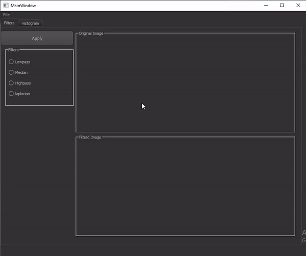

# Img-Filter

## About

>simple GUI was made for computer vision course, it has 2 tabs, one for filters and the other one for histogram equalization.

## Features
- The user can open and display any arbitrary image
- The user can choose between 4 filters.
- The user can see the filtered image alongside the original one.
- The user can see the histogram equalization of his image.


### Running

1. **_Clone the repository_**

```sh
$ git clone https://github.com/Yasien99/Img-Filter.git
```
2. **_Navigate to repository directory_**
```sh
$ cd Img-Filter\src

```
3. **_install project dependencies_**
```sh
pip install -r requirements.txt
```
4. **_Run the application_**
```sh
python main.py
```

<div align="center">
  
</div>
